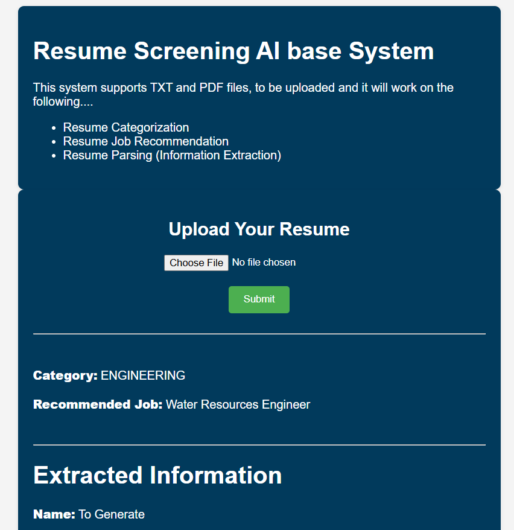

## Resume Screening App

### 1) Project Overview:

#### To develop an intelligent, automated system that streamlines the resume evaluation process using Natural Language Processing (NLP) and Machine Learning (ML). The system aims to:
- Reduce manual effort in resume screening
- Minimize bias and promote fairness
- Improve candidate-job matching accuracy
- Provide actionable feedback for resume improvement


## Application Screenshot




## Installation Guide
#### Follow these steps to set up and run the application:

### 1.Clone the Repository:
   ```bash
   git clone https://github.com/sanchit-yadav/Resume-Screening-System.git
   ```

### 2.Create a Virtual Environment: Make sure you have a virtual environment set up for your project.

### 3.Install Dependencies: Install the required dependencies using the requirements.txt file:

  
You can copy the following command and run it in your terminal:

```bash
pip install -r requirements.txt
```

I have used file path to load the data use your file path after downloading the data.

#### 4.Run the Application: To start the app, execute the following command in your terminal:
```bash
streamlit run app.py
```